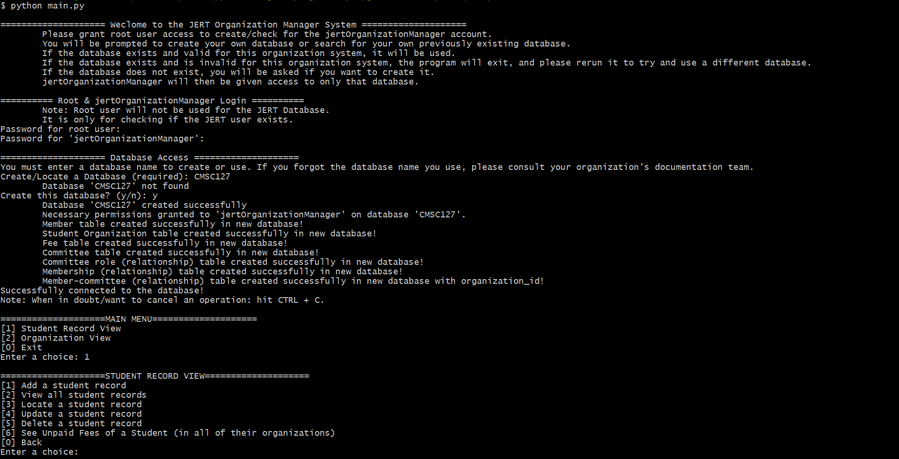

# 💻 JERT: Student Organization Management System

  

> A database project for CMSC 127: File Procesing & Database Systems. This CLI-based information system is designed to streamline the management of student organizations, their events, memberships, and finances. Developed primarily using Python and MySQL as the relational database management system.  

> Developed by:  
- Matthew Steven Toledo  
- Jaden Edric Pantastico  
- Jan Edrian Kadusale  

---

## 📚 Table of Contents

- [About](#-about)  
- [Features](#-features)  
- [Technology Stack](#-stack)
- [Usage](#-usage)  

---

## 📖 About

This management system is built for student organization environment. It provides a unified platform to manage:  
 
- Members & Student Records  
    - Add, update, delete, and search member/student profiles  
    - Track graduation status and date  
- Organizations & Committees  
    - Create and configure multiple student organizations  
    - Define and maintain committee structures and roles  
    - Assign and update member roles per semester/academic year  
- Financial Management  
    - Issue and track membership fees and payments  
    - Flag and report unpaid or late payments  
    - Generate financial summaries and detailed reporting  
- Reports & Analytics  
    - Unpaid fees by semester and academic year  
    - Highest‑debt members  
    - Late payment histories  
    - Active vs. Inactive membership percentages  
    - Historical leadership  

---

## ✨ Key Features

1. Interactive CLI Menus 🤸‍♂️
    - Intuitive text‑based navigation  
    - Step‑by‑step prompts ensure data integrity  

2. Role‑Based Access 🏃
    - Uses a dedicated jertOrganizationManager user  
    - Grants limited privileges to a single schema  
    - Root access only for setup and user provisioning  

3. Schema Validation & Auto‑Creation 📊
    - Checks for existing database and tables at startup
    - Offers smart creation of new databases and schema objects
    - Enforces presence of required tables & columns before use  

4. Extensible Design 🧠
    - Modular Python code (OOP) with JERTDatabaseManager class
    - SQL queries centralized or loaded from external files for easy maintenance
    - Tabular output using tabulate for readable CLI reporting  

---

## 💻 Technology Stack  
- Language: Python 3.x  
- Database: MySQL/MariaDB (via mysql-connector-python)  
- Libraries:   
    - mysql-connector-python for DB connectivity  
    - tabulate for formatted tables  
- andard library modules: getpass, datetime, argparse  